<h1 align="center">Tyler Bair (TeaBear5)</h1>

  I build field deployable, real time perception systems for low altitude airspace awareness.

  <a href="mailto:tyler@lighthouseavionics.com">tyler@lighthouseavionics.com</a>

## About

I work at the intersection of embedded Linux, GPU accelerated computer vision, and full stack product delivery, with a focus on systems that perform reliably outside the lab (latency disciplined, streaming robust, operator friendly).

Common problem space includes detection and tracking of small fast moving objects, multi camera sensing, sensor fusion, and real time inference deployment on edge hardware.

## Core areas

* Edge computer vision (detection, tracking, classification)
* GPU acceleration (CUDA, TensorRT), profiling and throughput tuning
* Real time video pipelines (GStreamer, DeepStream), streaming and transport reliability
* Embedded Linux and systems engineering (services, networking, deployment hardening)
* Product engineering (Django backends, APIs, Vue plus Vuetify frontends)

## Skills and tooling

  
  
  

  
  
  
  

  
  
  
  

  
  
  

  
  
  

## Live GitHub metrics

## Contact

* Email, <a href="mailto:tyler@lighthouseavionics.com">tyler@lighthouseavionics.com</a>
